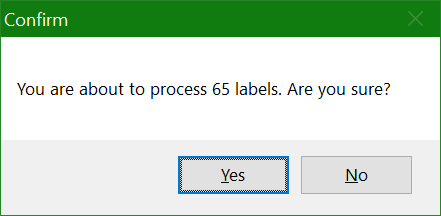
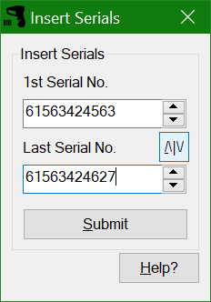
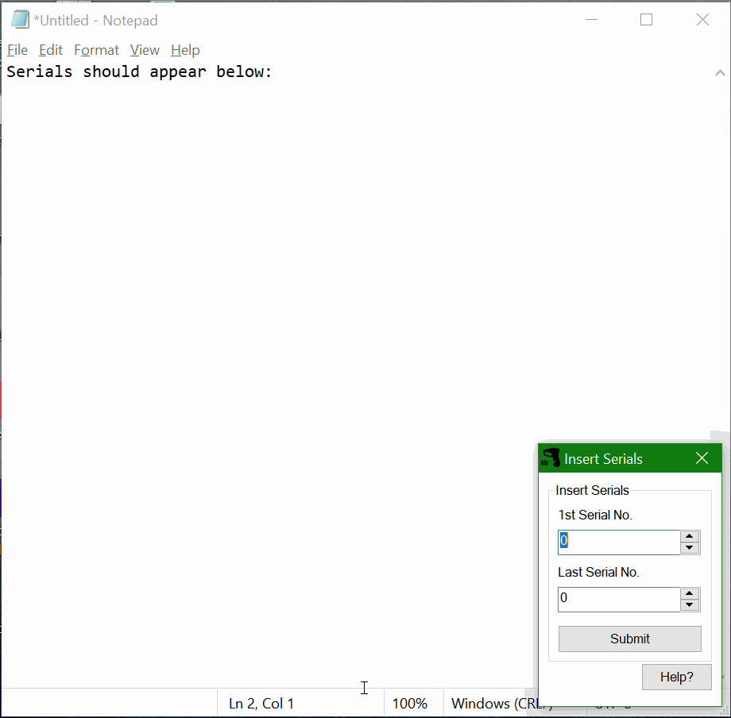

# Possible Scanning Solution

## What does it do?
This (very) simple application should reduce the errors in the process of scanning barcodes. 

## How to Use
The way it works is simple:
* The operator will open the scanning application as normal, and scan the first barcode and entering the correct data on the traceability sheet
* The operator will then open this application
* Scan the First and Last barcodes in the strip
* Click Submit and let it do its thing! The program will "scan" [type] each barcode and hit Enter. (First barcode is ommited as it has already been scanned)

# Changelog

## 26/04/2020 #2
* The program will now find the window to scan into, instead of relying on Alt+Tab (will save a lot of confusion/error)

## 26/04/2020
* Added a confirmation dialog that also contains total number of labels to "scan"

* Added a swap button to reverse the values if in wrong order

## 15/04/2020
Initial development/upload and Demo

# Possible Additions:
- [x] ~~Add a total number of barcodes on the UI so the operator can double check~~
- [x] ~~Find the actual scanning window's name so I don't have to rely on Alt+Tab~~

# Working Demo

## Additional Info
This was made as an AHK script, then just converted to an executable. The script is fully readable in case of any issues with security.
